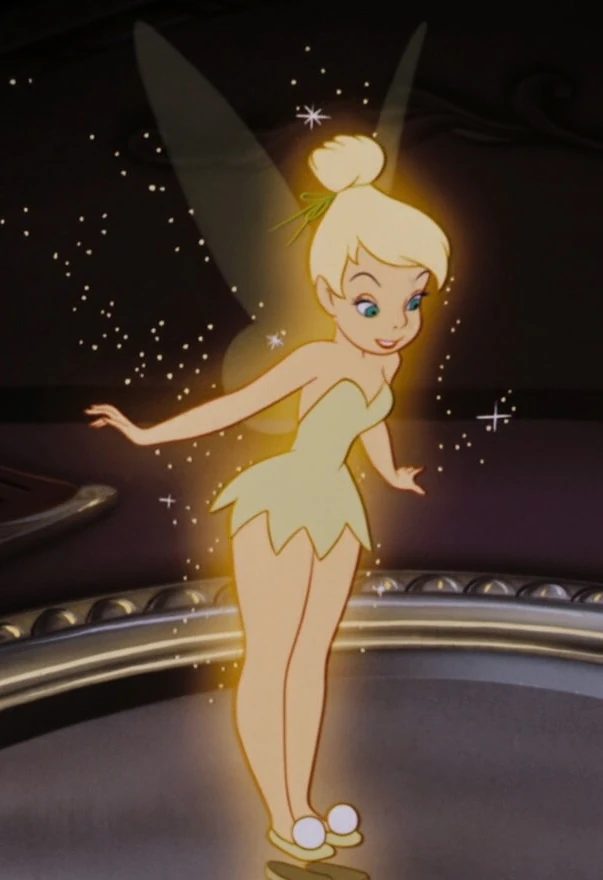

# Csipkebogyó kvíz 2024

## I. kérdés csoport (Rólunk szól...)

### Három kívánság
Kinek a kívánsága az alábbi?

### Trükközősek...
Hányan írták be a kérdőívbe, hogy "Legyen még három kívánságom!" válaszul a három kívánságos kérdésre?

Megfejtés:
- 3 (Zsiga, Réci, Andris)

Lehetőségek:
- [ ] 0
- [ ] 1
- [x] 3
- [ ] 5

### World Wide
Ki fogalmazott meg vakamilyen utazással / világot látással kapcsolatos kívánságot?

Megfejtés:
- Gyöngyös szeretne Sydnie híd tetejére felmenni és Koreába eljutni  
- Léna szeretne valamilyen repülőzős ViP kártyát, hogy élete végéig olcsón repülhessen

Lehetőségek:
- [ ] Réci
- [x] Gyöngyös
- [ ] Eszter
- [x] Léna

### Kedvenc mesehős 1.
Ki tud azonosulni a képen látható mesehőssel?

Megfejtés:
- Orsi (Régen volt kedvence, és azért mert mindketten pipacspirosak lesznek, ha valami nem tetszik / mérgesek / nem úgy alakul valami, ahogyan elképzelték)

Lehetőségek:
- [ ] Csenge
- [ ] Eszter
- [x] Orsi
- [ ] Léna

### Kedvenc mesehős 2.
Ki tud azonosulni a képen látható mesehőssel?

Megfejtés:
- Eszter: "Talán kinézetre is hasonlítunk, de szeret énekelni, szereti az állatokat stb."

Lehetőségek:
- [ ] Orsi
- [x] Eszter
- [ ] Léna
- [ ] Anna

### Kedvenc mesehős 3.

Ki tud azonosulni a képen látható mesehőssel?

