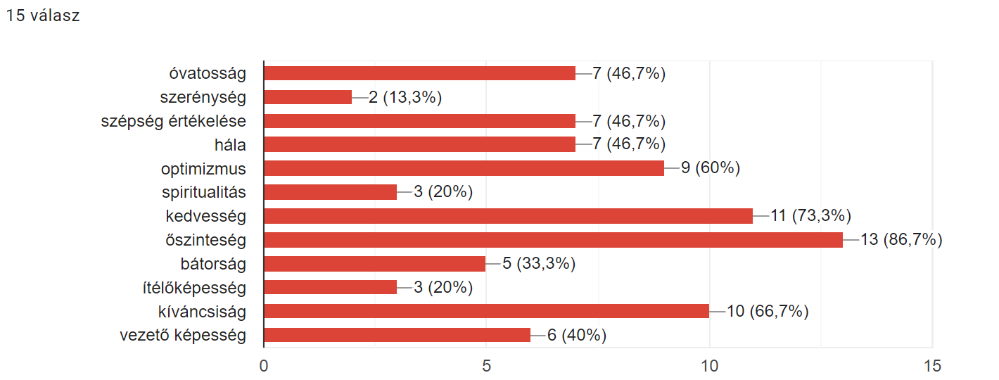

# Csipkebogyó kvíz 2024

## I. kérdés csoport (Rólunk szól...)

### Három kívánság
Kinek a kívánsága az alábbi?

### Trükközősek...
Hányan írták be a kérdőívbe, hogy "Legyen még három kívánságom!" válaszul a három kívánságos kérdésre?

Megfejtés:
- 4 (Zsiga, Réci, Andris, Sára)

Lehetőségek:
- [ ] 0
- [ ] 1
- [x] 4
- [ ] 6

### World Wide
Ki fogalmazott meg vakamilyen utazással / világot látással kapcsolatos kívánságot?

Megfejtés:
- Gyöngyös szeretne Sydnie híd tetejére felmenni és Koreába eljutni  
- Léna szeretne valamilyen repülőzős ViP kártyát, hogy élete végéig olcsón repülhessen

Lehetőségek:
- [ ] Réci
- [x] Gyöngyös
- [ ] Eszter
- [x] Léna

### Kedvenc mesehős 1.
Ki tud azonosulni a képen látható mesehőssel?

Megfejtés:
- Orsi (Régen volt kedvence, és azért mert mindketten pipacspirosak lesznek, ha valami nem tetszik / mérgesek / nem úgy alakul valami, ahogyan elképzelték)

Lehetőségek:
- [ ] Csenge
- [ ] Eszter
- [x] Orsi
- [ ] Léna

### Kedvenc mesehős 2.
Ki tud azonosulni a képen látható mesehőssel?

Megfejtés:
- Eszter: "Talán kinézetre is hasonlítunk, de szeret énekelni, szereti az állatokat stb."

Lehetőségek:
- [ ] Orsi
- [x] Eszter
- [ ] Léna
- [ ] Anna

### Kedvenc mesehős 3.

Ki tud azonosulni a képen látható mesehőssel?

Megfejtés:
- Bálint ... a kacsa hang miatt

Lehetőségek:
- [ ] Anna
- [ ] Gyöngyös
- [x] Bálint
- [ ] Emese

### Kedvenc mesehős 4.

Ki tud azonosulni a képen látható mesehőssel?

Megfejtés:
- Csenge, mert segítőkész

Lehetőségek:
- [ ] Anna
- [x] Csenge
- [ ] Gyöngyös
- [ ] Andris

### Kedvenc mesehős 5.

Ki tud azonosulni a képen látható mesehőssel?

Megfejtés:
- Andris ... versenyzés és ha úgy van akkor annak felülírása egy nagyobb jó érdékebén

Lehetőségek:
- [ ] Zsiga
- [ ] Bálint
- [x] Andris
- [ ] Emese

### Kedvenc mesehős 6.

Ki tud azonosulni a képen látható mesehőssel?

Megfejtés:
- Réci: "mert hasonlóan naív vagyok"

Lehetőségek:
- [ ] Anna
- [ ] Csenge
- [ ] Eszter
- [x] Réci

### Kedvenc mesehős 7.

Ki tud azonosulni a képen látható mesehőssel?

Megfejtés:
- Gyöngyös: "Szeretem a lyukas, a kerek, a szögletes, a tömör, a gömbölyű csokoládét."

Lehetőségek:
- [x] Gyöngyös
- [ ] Bálint
- [ ] Csenge
- [ ] Zsiga

### Szobrászat

Gyöngyös számára kedves meseszereplő, Gombóc Artúr szobra megtalálható a Balatonnál.
Pontosan hol van ez a szobor?

Megfejtés:
- A szobor a Tihanyi Bencés Apátságnál, a Pisky sétány mentén található. Az alkotás Kolodko Mihály munkája.

Lehetőségek:
- [ ] Siófok
- [ ] Zamárdi
- [ ] Zánka 
- [x] Tihany

### Kedvenc mesehős 8.

Ki tud azonosulni a képen látható mesehőssel?

Megfejtés:
- Léna: "Elsőként Sid jut eszembe a jégkorszakból, mert szeret bolondozni, de óriási szeretettel van a többiek felé, néha picit naiv, de amúgy vicces amiket művel :))"

Lehetőségek:
- [x] Léna
- [ ] Anna
- [ ] Sári
- [ ] Zsiga

### Kedvenc mesehős 9.

Ki tud azonosulni a képen látható mesehőssel?

Megfejtés:
- Sári "... mert elszánt, kitartó, és meg akarja védeni a családját. Ja és nőként harcol a férfiak között…"

Lehetőségek:
- [ ] Eszter
- [ ] Anna
- [x] Sári
- [ ] Orsi

### Miss South Carolina

A felvétel a Miss Teen USA 2007 szépségversenyen készült.

<iframe width="560" height="315" src="https://www.youtube.com/embed/lj3iNxZ8Dww?si=R3-OVZyOycjaJCi9&amp;start=9" title="YouTube video player" frameborder="0" allow="accelerometer; autoplay; clipboard-write; encrypted-media; gyroscope; picture-in-picture; web-share" referrerpolicy="strict-origin-when-cross-origin" allowfullscreen></iframe>

Mi volt a kérdés, amire válaszol a hölgy?

Megfejtés:
- Miért van az, hogy az Egyesült Államok lakosságának ötöde nem találja a térképen az USA-t?

Lehetőségek:
- [ ] Hogyan csökkenthetnénk a világban jelenlévő éhinséget?
- [x] Miért van az, hogy az Egyesült Államok lakosságának ötöde nem találja a térképen az USA-t?
- [ ] Hogyan növelhetnénk az Egyesült Államokban az oktatás minőségét?
- [ ] Hogyan zárkóztathatnánk fel a fejlődő országok oktatási rendszereit az Egyesült Államok szintjére?

### Kedvenc játék 1.

Kinek a gyerekkori játéka volt Foltos, a maci.

Megfejtés:
- Orsi ... egy darab foltja volt...

Lehetőségek:
- [ ] Csenge
- [x] Orsi
- [ ] Bálint
- [ ] Anna

### Kedvenc játék 2.

Kinek a gyerekkori játékai voltak Pipi és Maci.

Megfejtés:
- Eszter alvós játékai

Lehetőségek:
- [ ] Csenge
- [ ] Anna
- [ ] Léna
- [x] Eszter

### Kedvenc játék 3.

Kinek a gyerekkori játékai voltak Pipi és Maci.

Megfejtés:
- Eszter alvós játékai

Lehetőségek:
- [ ] Csenge
- [ ] Anna
- [ ] Léna
- [x] Eszter

### Kedvenc játék 4.

Kinek a gyerekkori játéka volt egy kis autó, amit sokszor magával vitt.

Megfejtés:
- Gyöngyös

Lehetőségek:
- [ ] Bálint
- [ ] Andris
- [x] Gyöngyös
- [ ] Réci

### Kedvenc játék 5.

Kinek a gyerekkori játéka volt Peti, a plüs kutya.

Megfejtés:
- Csenge

Lehetőségek:
- [x] Csenge
- [ ] Andris
- [ ] Gyöngyös
- [ ] Léna

### Kedvenc játék 6.

Kinek a gyerekkori játéka volt Peti, a plüs kutya.

Megfejtés:
- Csenge

Lehetőségek:
- [x] Csenge
- [ ] Andris
- [ ] Gyöngyös
- [ ] Léna

### Kedvenc játék 7.

Kinek a kedvenc gyerekkori játéka volt egy plüs cica.

Megfejtés:
- Andris: "... Nevére nem emlékszem, de volt neki."

Lehetőségek:
- [ ] Csenge
- [x] Andris
- [ ] Gyöngyös
- [ ] Léna

### Kedvenc játék 8.

Kinek a kedvenc gyerekkori játéka volt egy alvós rongybaba.

Megfejtés:
- Léna játéka, és a neve Babi

Lehetőségek:
- [ ] Csenge
- [ ] Andris
- [ ] Gyöngyös
- [x] Léna

### Kedvenc játék 9.

Kinek a kedvenc gyerekkori játéka volt Csicsi.

Megfejtés:
- Réci nyunyókája volt Csicsi

Lehetőségek:
- [ ] Eszter
- [ ] Zsiga
- [x] Réci
- [ ] Bálint

### Vakáció
Orsi szívesen újraélne egy görögországi családi nyaralást.
Milyen különleges élményt éltek ott át közösen?

Megfejtés:
- "Mikor egyszer Görögországban egy kis faluban sétáltunk este a családommal és a csillaghullást néztük. (A végére mindenkinek a nyaka begörcsölt.)"

- [ ] együtt úsztak a cápákkal
- [ ] részt vettek egy helyi esküvőn
- [x] a csillaghullást nézték egy kis falubból
- [ ] nézőként részt vettek egy autóversenyen

### Melyik szülő?
Megkérdeztük, hogy melyik szülőtökre hasonlítotok jobban?
Mit tippeltek: az anyukák, vagy az apukák kaptak több szavazatot?

Megfejtés:
- Az apák nyertek 63,6%-kal.

Lehetőségek:
- [ ] anyák
- [x] apák

### Örök fiatalság

Ki az, aki néha úgy érzi, hogy szívesen visszatérne az óvodás korba?

Megfejtés:
- Léna

Lehetőségek:
- [ ] Eszter
- [x] Léna
- [ ] Zsiga
- [ ] Csenge

### Erősségek

Melyik az a két legnépszerűbb tulajdonság, amit a legtöbb Csipkebogyó jelölt meg, mint rá jellemző erősséget?

Megfejtés:
- őszinteség (12/13; 92,3%), kedvesség (9/13; 69,2%)

Lehetőségek:
- [x] őszinteség, kedvesség
- [ ] kedvesség, bátorság
- [ ] kíváncsiság, optimizmus
- [ ] optimizmus, vezető képesség

 
